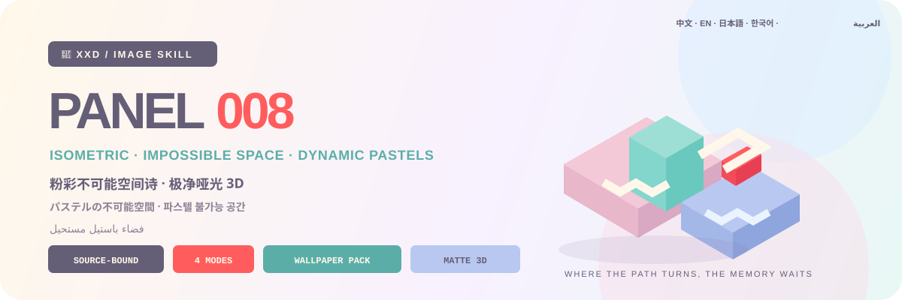

<p align="center">
  
</p>

<div align="center">

# 🦁 XXD Panel 008

### 把真实照片转译成明亮、安静、聪明的粉彩不可能空间

[](./SKILL.md)
[](#四种输出共享同一种空间诗逻辑)
[](#边界与信任)

<strong>简体中文</strong> · <a href="README.en.md">English</a> · <a href="README.ja.md">日本語</a> · <a href="README.ko.md">한국어</a> · <a href="README.ar.md">العربية</a>

</div>

> 正交等距 · 平台／台阶／门洞 · 空间悖论 · 动态粉彩 · 极净哑光 3D

XXD Panel 008 是一个面向 Codex 与兼容 Agent 的图像生成 Skill。它把照片中最可辨认的身份、轮廓、姿态与关系转译为平台、台阶、门洞、拱桥、通道、悬浮结构和不可能连接。

高低差、路径、连接、遮挡、孤立与重复承担叙事；正交等距视角让空间清楚而诗意。每张作品使用 2–4 个明亮粉彩主色和唯一一处高纯度跳色，再以极净、平滑、哑光的纯色 3D 与一句小型几何注释留下余韵。

## 为什么需要 008

普通“纪念碑式空间”很容易退化成任意台阶、现成关卡和一套与照片无关的粉彩建筑。

008 的顺序完全相反：

```text
锁定源图事实 → 把身份与关系分配给空间几何 → 用高低／路径／连接／遮挡／孤立／重复组织叙事 → 锁定正交等距相机 → 选择 2–4 个动态粉彩主色与唯一跳色 → 以极净哑光 3D 完成
```

如果换成一张无关照片，空间隐喻、路线、高低关系、锚点几何、跳色和文案仍然成立，这张图就不属于 008。

## 008 的视觉契约

- **源图专属空间隐喻：** 至少三个身份、姿态、动作、功能、情绪或关系线索进入同一个几何系统。
- **几何有职责：** 平台、台阶、门洞、拱桥、通道、悬浮结构与不可能连接都必须对应源图事实。
- **空间叙事：** 高低表达层级或距离，路径表达动作，桥与通道表达关系，遮挡、孤立与重复表达情绪和节奏。
- **正交等距：** 相机干净、结构清楚，不做摄影透视、拥挤城市、迷宫堆砌或游戏关卡。
- **动态粉彩：** 2–4 个奶油、砂岩、粉、紫、蓝、青、薄荷色主色形成相邻色与冷暖对比。
- **唯一跳色：** 全画面只有一处更高纯度的橙红、玫红、蓝绿或明黄，落在决定性位置。
- **极净哑光 3D：** 纯色平滑几何、柔和均匀光线和轻微环境阴影；没有颗粒、纸纹、胶片、磨砂、旧印刷、PBR 或强反光。
- **小型空间注释：** 只有一句纤细几何文案；不出现年份、日期、编号、卷号、大标题或静默英语翻译。

## 样张 · 即将补充

项目已预留 [`assets/examples/`](assets/examples/) 样张目录。只有经项目作者确认、确实使用 008 完成的作品才会加入；在此之前不借用其他风格的推文或图片作为占位。

未来样张只用于展示 008 对不同题材的适应力，不会把样张主体、空间机关、配色、文案或画幅变成生成参考或默认值。

## 四种输出共享同一种空间诗逻辑

四种模式支持单选或多选。可回复 `1`、`1+3`、`1、2、4` 或 `全部`；Skill 去重后按 1→4 执行。每种模式独立输出并进入独立子文件夹，不制作总图；`全部` 每张原图得到 7 个 PNG（前三种各 1 张＋壁纸 4 张）。尺寸可在同一回复中按模式标注，未标注普通模式按源图适配；文案默认跨所选模式共用，也可按模式单独指定。

| 模式 | 尺寸逻辑 | 成品 |
| --- | --- | --- |
| `top-bottom` | 源图自适应 | 上方完整原图，下方 008 粉彩不可能空间；两块都保持原图完整尺寸，严格 50/50 |
| `left-right` | 源图自适应 | 左侧完整原图，右侧 008 粉彩不可能空间；两块都保持原图完整尺寸，严格 50/50 |
| `design-only` | 源图自适应 | 只显示变化设计，不显示原照片；沿用原图比例和尺寸 |
| `wallpaper-pack` | 四种设备尺寸 | 分别输出手机、iPad、电脑、儿童手表四张 PNG |

用户精确尺寸 > 指定比例或用途 > 普通模式源图自适应。原始 `008.md` 里的 3:4 只是一开始的创作画幅，不会被写成当前 Skill 的静默默认值。

双联模式的摄影区域保持真实，只允许克制调色和必要的环境扩展。纯设计版与壁纸仍以照片为事实依据，但不显示原片。

### 四端壁纸：连贯或独立

壁纸没有静默尺寸默认。可选择常用预设——手机 `1440×3200`、iPad `2048×2732`、电脑 `3840×2160`、儿童手表 `1024×1024`——也可逐设备自定义。

- **连贯套装（推荐）：** 先生成并验收 iPad 定调图，另外三张都直接参考原照片＋同一张定调图，分别为设备重新构图。
- **四张独立：** 每张只参考原照片，可以分别探索不同的空间隐喻、路线、高低关系、粉彩组合与跳色位置。

连贯不等于裁切。四张壁纸始终分别生成、分别构图、分别验收，也不会按 iPad→手机→电脑→手表顺序垫图造成漂移。

## 文字只留下空间之后的余韵

正式生图前，先选择自动文案、自定义文案或无文字。有文字时还要指定目标语言或地区。

自动文案从可见情绪、关系、动作、空间张力或有依据的故事中提炼一句短而有余韵的话。默认只使用目标语言；双语只有用户明确要求时才出现。

008 不会在自动文案里为了装饰加入年份、日期、编号、卷号或档案标签，也不会静默添加英语意译；用户的准确成稿始终逐字保留。

用户提供最终成稿时逐字保留。用户提供的是方向或可编辑草稿时，才会在保留受众、目的、必备词、语气和潜台词的前提下专业深化。

语言遵循目标受众，而不是用户下指令时使用的语言：

```text
目标市场或受众 > 指定成品语言 > 用户方向语言；都不明确时生图前询问
```

日本版使用自然日语，韩国受众使用自然韩语与正确空格，英国版使用英式英语，阿拉伯语版默认使用自然的现代标准阿拉伯语和真正的从右到左排版。字体会在当地文字系统中保持安静、低密度的书封感，而不是把拉丁规则生硬套过去。

## 精确拼版交给代码，作品交给图像生成

图像模型负责源图专属空间隐喻、正交等距几何、动态粉彩、唯一跳色、极净哑光 3D 与小型几何注释。`scripts/compose_panel.py` 只负责画布规划、精确 50/50 位图拼合、最终尺寸和审计，不会用程序绘图伪造成品。

```bash
python3 scripts/compose_panel.py --plan --layout top-bottom --source photo.png
python3 scripts/compose_panel.py --plan --layout left-right --size 2560x1440
python3 scripts/compose_panel.py --audit result.png --layout design-only --size 2048x2048
```

精确上下画布的总高度必须为偶数，精确左右画布的总宽度必须为偶数。Skill 不会静默修改用户指定的像素。

## 开始使用

```bash
git clone https://github.com/nevertoday/xxd-panel-008.git
mkdir -p ~/.codex/skills
ln -s "$(pwd)/xxd-panel-008" ~/.codex/skills/xxd-panel-008
```

Claude Code 用户可以把同一目录链接到 `~/.claude/skills/xxd-panel-008`。安装后重新启动 Agent 会话。

```text
$xxd-panel-008
把这张照片做成左右双联，文案由你根据照片内涵创作，使用自然韩语。
```

只上传照片也可以调用。Skill 会先用分行编号菜单询问一个或多个模式，再询问文字设置；选择壁纸时还会确认连贯或独立以及设备尺寸。

完整规范：

- [Skill 工作流](SKILL.md)
- [中文完整提示词](references/xxd-panel-008-prompt.zh-CN.md)
- [英文完整提示词](references/xxd-panel-008-prompt.en.md)
- [原始风格提示词](references/008-source.md)

## 边界与信任

- 每张照片只在自己的任务中使用，不借用其他输入、旧成品或样张里的主体、颜色、文案和构图。
- 每次调用都创建新的任务子文件夹；相同原图和参数也要重新生成，旧成品不能冒充当前任务。
- 最终交付为 PNG 位图，不是 SVG、HTML、Canvas 或程序绘图替代品。
- 已配置位图桥接只返回脱敏状态，不显示供应商、端点、请求头、凭据、提示词或服务器响应正文。
- 每个所选普通模式各返回一张；若选择 `wallpaper-pack`，再返回四张独立壁纸。选择 `全部` 时每张原图共返回 7 个 PNG，分处四个同级模式文件夹，绝不生成拼贴总览。

本地拼版需要 Python 3 和 Pillow。安全位图桥接使用 Python 3.11+ 的 `tomllib`。图像生成仍需要主机 Agent 的内置位图能力或已经配置好的兼容位图路径。

## 项目结构

```text
xxd-panel-008/
├── SKILL.md
├── README.md / README.en.md / README.ja.md / README.ko.md / README.ar.md
├── agents/openai.yaml
├── assets/
│   ├── banner.svg
│   └── examples/（未来本地样张占位）
├── scripts/
│   ├── compose_panel.py
│   └── configured_imagegen.py
└── references/
    ├── xxd-panel-008-prompt.zh-CN.md
    ├── xxd-panel-008-prompt.en.md
    └── 008-source.md
```

## 关于 XXD

XXD 是小小东的品牌名称缩写。项目由 [@xiaoxiaodong01](https://x.com/xiaoxiaodong01) 创建并维护。

## 服务与会员

### 深度咨询 · 299 元/小时

Skills 使用的一对一深度咨询按 299 元/小时收费。请通过下方微信二维码联系小小东预约。

### 小小东 Skills 用户交流群 · 入群 99 元

一次支付 99 元加入用户交流群，用于交流工作流、作品与互助；不包含按小时的一对一深度咨询。扫码后请备注“Skills 用户交流群”。

### 知识星球＋成员提示词库 · 699 元/年

[知识星球](https://wx.zsxq.com/group/15554814142882)与[小小东成员提示词库](https://vip.xiaoxiaodong.ai/)是同一份会员权益：**一次年费同时开通两边，无需重复付费。**

1. 在[知识星球](https://wx.zsxq.com/group/15554814142882)开通后，微信联系小小东领取成员提示词库兑换码。
2. 在[成员提示词库](https://vip.xiaoxiaodong.ai/)自助开通后，微信联系小小东邀请进入知识星球。

<p align="center">
  <a href="https://xiaoxiaodong.pages.dev/assets/wechat-qr.png"></a>
</p>

<div align="center">

**真实世界留下记忆，几何空间把它变成一条可以行走的情绪。**

</div>

---

<div align="center">
  <h2>☕ 为开源项目赞助算力</h2>
  <p>如果这个项目为你节省了时间，可以通过微信或支付宝赞助后续测试与生成算力。</p>
  <table>
    <tr>
      <td align="center" width="240">
        <a href="https://colors.xiaoxiaodong.ai/docs/images/wechat-reward-qr.png"></a><br>
        <strong>微信算力赞助</strong>
      </td>
      <td align="center" width="240">
        <a href="https://colors.xiaoxiaodong.ai/docs/images/alipay-reward-qr.png"></a><br>
        <strong>支付宝算力赞助</strong>
      </td>
    </tr>
  </table>
  <p><sub>赞助完全自愿，不会改变这个开源项目的使用权限。</sub></p>
</div>
